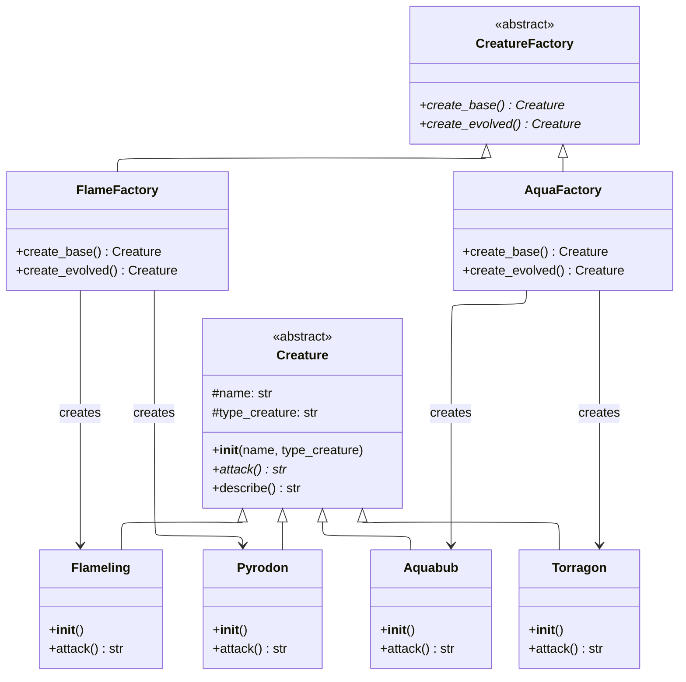

# Abstract Factory Pattern - UML Class Diagram

```mermaid
---
config:
  layout: elk
---
classDiagram
    class Creature {
        <<abstract>>
        #name: str
        #type_creature: str
        +__init__(name, type_creature)
        +attack()* str
        +describe() str
    }

    class Flameling {
        +__init__()
        +attack() str
    }

    class Pyrodon {
        +__init__()
        +attack() str
    }

    class Aquabub {
        +__init__()
        +attack() str
    }

    class Torragon {
        +__init__()
        +attack() str
    }

    class CreatureFactory {
        <<abstract>>
        +create_base()* Creature
        +create_evolved()* Creature
    }

    class FlameFactory {
        +create_base() Creature
        +create_evolved() Creature
    }

    class AquaFactory {
        +create_base() Creature
        +create_evolved() Creature
    }

    Creature <|-- Flameling
    Creature <|-- Pyrodon
    Creature <|-- Aquabub
    Creature <|-- Torragon

    CreatureFactory <|-- FlameFactory
    CreatureFactory <|-- AquaFactory

    FlameFactory --> Flameling : creates
    FlameFactory --> Pyrodon : creates

    AquaFactory --> Aquabub : creates
    AquaFactory --> Torragon : creates
```