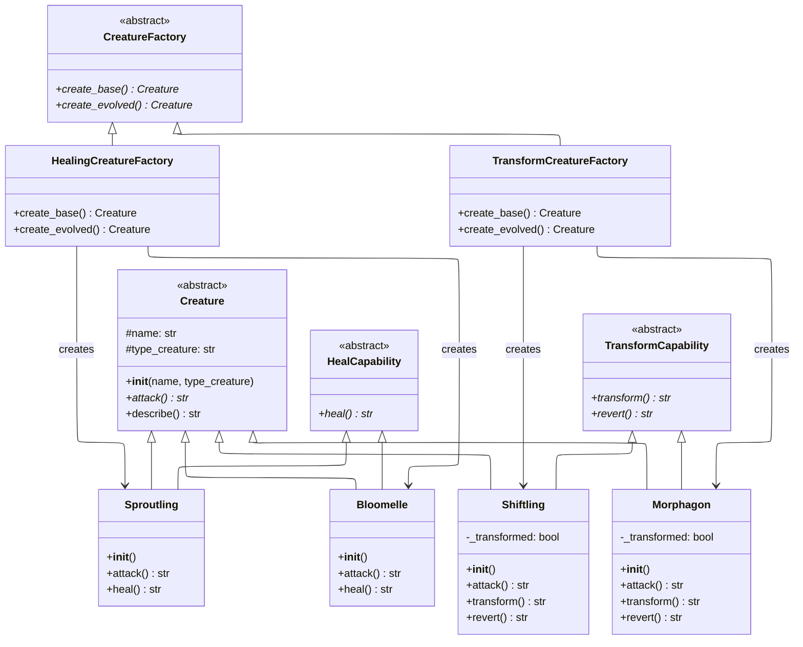

# Abstract Factory Pattern with Capabilities - UML Class Diagram

```mermaid
---
config:
  layout: elk
---
classDiagram

    class Creature {
        <<abstract>>
        #name: str
        #type_creature: str
        +__init__(name, type_creature)
        +attack()* str
        +describe() str
    }

    class HealCapability {
        <<abstract>>
        +heal()* str
    }

    class TransformCapability {
        <<abstract>>
        +transform()* str
        +revert()* str
    }

    class Sproutling {
        +__init__()
        +attack() str
        +heal() str
    }

    class Bloomelle {
        +__init__()
        +attack() str
        +heal() str
    }

    class Shiftling {
        -_transformed: bool
        +__init__()
        +attack() str
        +transform() str
        +revert() str
    }

    class Morphagon {
        -_transformed: bool
        +__init__()
        +attack() str
        +transform() str
        +revert() str
    }

    class CreatureFactory {
        <<abstract>>
        +create_base()* Creature
        +create_evolved()* Creature
    }

    class HealingCreatureFactory {
        +create_base() Creature
        +create_evolved() Creature
    }

    class TransformCreatureFactory {
        +create_base() Creature
        +create_evolved() Creature
    }

    Creature <|-- Sproutling
    Creature <|-- Bloomelle
    Creature <|-- Shiftling
    Creature <|-- Morphagon

    HealCapability <|-- Sproutling
    HealCapability <|-- Bloomelle

    TransformCapability <|-- Shiftling
    TransformCapability <|-- Morphagon

    CreatureFactory <|-- HealingCreatureFactory
    CreatureFactory <|-- TransformCreatureFactory

    HealingCreatureFactory --> Sproutling : creates
    HealingCreatureFactory --> Bloomelle : creates

    TransformCreatureFactory --> Shiftling : creates
    TransformCreatureFactory --> Morphagon : creates
```