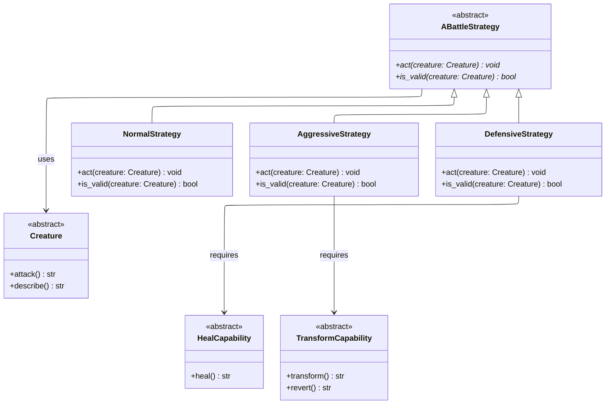

```mermaid
---
config:
  layout: elk
---
classDiagram

    class ABattleStrategy {
        <<abstract>>
        +act(creature: Creature) void*
        +is_valid(creature: Creature) bool*
    }

    class NormalStrategy {
        +act(creature: Creature) void
        +is_valid(creature: Creature) bool
    }

    class AggressiveStrategy {
        +act(creature: Creature) void
        +is_valid(creature: Creature) bool
    }

    class DefensiveStrategy {
        +act(creature: Creature) void
        +is_valid(creature: Creature) bool
    }

    class Creature {
        <<abstract>>
        +attack() str
        +describe() str
    }

    class HealCapability {
        <<abstract>>
        +heal() str
    }

    class TransformCapability {
        <<abstract>>
        +transform() str
        +revert() str
    }

    ABattleStrategy <|-- NormalStrategy
    ABattleStrategy <|-- AggressiveStrategy
    ABattleStrategy <|-- DefensiveStrategy

    ABattleStrategy --> Creature : uses

    AggressiveStrategy --> TransformCapability : requires
    DefensiveStrategy --> HealCapability : requires
```