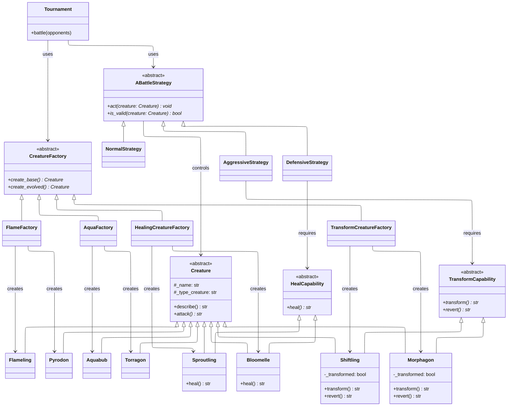

# DataDeck - Global Architecture UML Diagram

```mermaid
---
config:
  layout: elk
---
classDiagram

%% =========================
%% CORE CREATURE SYSTEM
%% =========================

    class Creature {
        <<abstract>>
        #_name: str
        #_type_creature: str
        +describe() str
        +attack()* str
    }

    class Flameling
    class Pyrodon
    class Aquabub
    class Torragon

    Creature <|-- Flameling
    Creature <|-- Pyrodon
    Creature <|-- Aquabub
    Creature <|-- Torragon


%% =========================
%% CAPABILITIES
%% =========================

    class HealCapability {
        <<abstract>>
        +heal()* str
    }

    class TransformCapability {
        <<abstract>>
        +transform()* str
        +revert()* str
    }

    class Sproutling {
        +heal() str
    }

    class Bloomelle {
        +heal() str
    }

    class Shiftling {
        -_transformed: bool
        +transform() str
        +revert() str
    }

    class Morphagon {
        -_transformed: bool
        +transform() str
        +revert() str
    }

    Creature <|-- Sproutling
    Creature <|-- Bloomelle
    Creature <|-- Shiftling
    Creature <|-- Morphagon

    HealCapability <|-- Sproutling
    HealCapability <|-- Bloomelle

    TransformCapability <|-- Shiftling
    TransformCapability <|-- Morphagon


%% =========================
%% ABSTRACT FACTORY
%% =========================

    class CreatureFactory {
        <<abstract>>
        +create_base()* Creature
        +create_evolved()* Creature
    }

    class FlameFactory
    class AquaFactory

    class HealingCreatureFactory
    class TransformCreatureFactory

    CreatureFactory <|-- FlameFactory
    CreatureFactory <|-- AquaFactory
    CreatureFactory <|-- HealingCreatureFactory
    CreatureFactory <|-- TransformCreatureFactory

    FlameFactory --> Flameling : creates
    FlameFactory --> Pyrodon : creates

    AquaFactory --> Aquabub : creates
    AquaFactory --> Torragon : creates

    HealingCreatureFactory --> Sproutling : creates
    HealingCreatureFactory --> Bloomelle : creates

    TransformCreatureFactory --> Shiftling : creates
    TransformCreatureFactory --> Morphagon : creates


%% =========================
%% STRATEGY PATTERN
%% =========================

    class ABattleStrategy {
        <<abstract>>
        +act(creature: Creature)* void
        +is_valid(creature: Creature)* bool
    }

    class NormalStrategy
    class AggressiveStrategy
    class DefensiveStrategy

    ABattleStrategy <|-- NormalStrategy
    ABattleStrategy <|-- AggressiveStrategy
    ABattleStrategy <|-- DefensiveStrategy

    ABattleStrategy --> Creature : controls

    AggressiveStrategy --> TransformCapability : requires
    DefensiveStrategy --> HealCapability : requires


%% =========================
%% TOURNAMENT SYSTEM
%% =========================

    class Tournament {
        +battle(opponents)
    }

    Tournament --> CreatureFactory : uses
    Tournament --> ABattleStrategy : uses
```